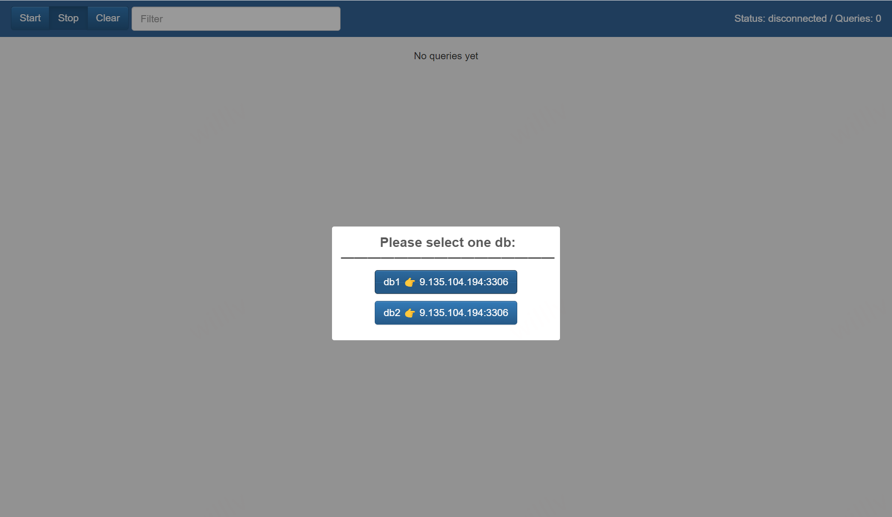
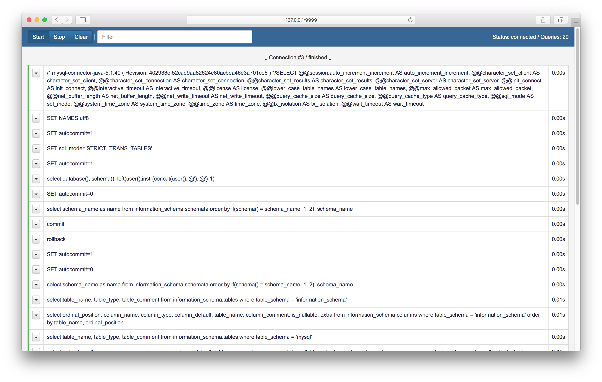
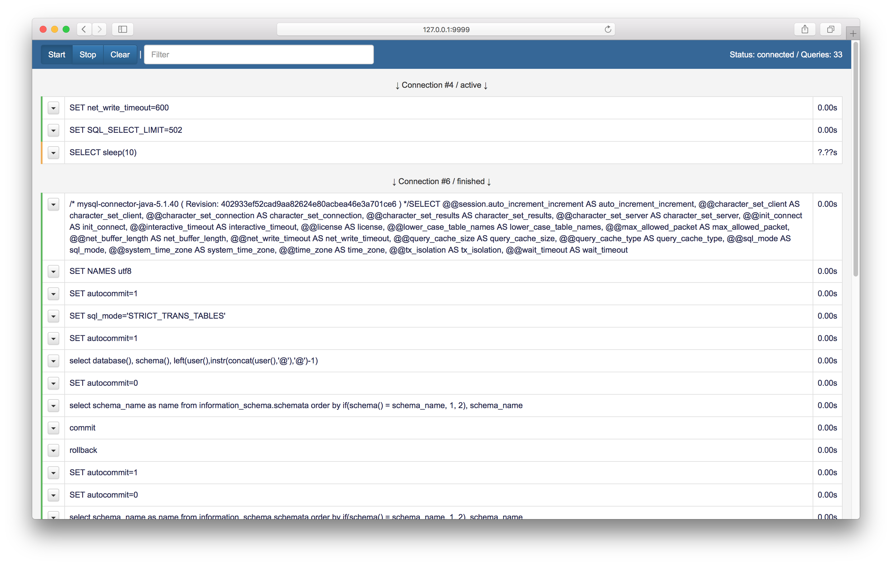
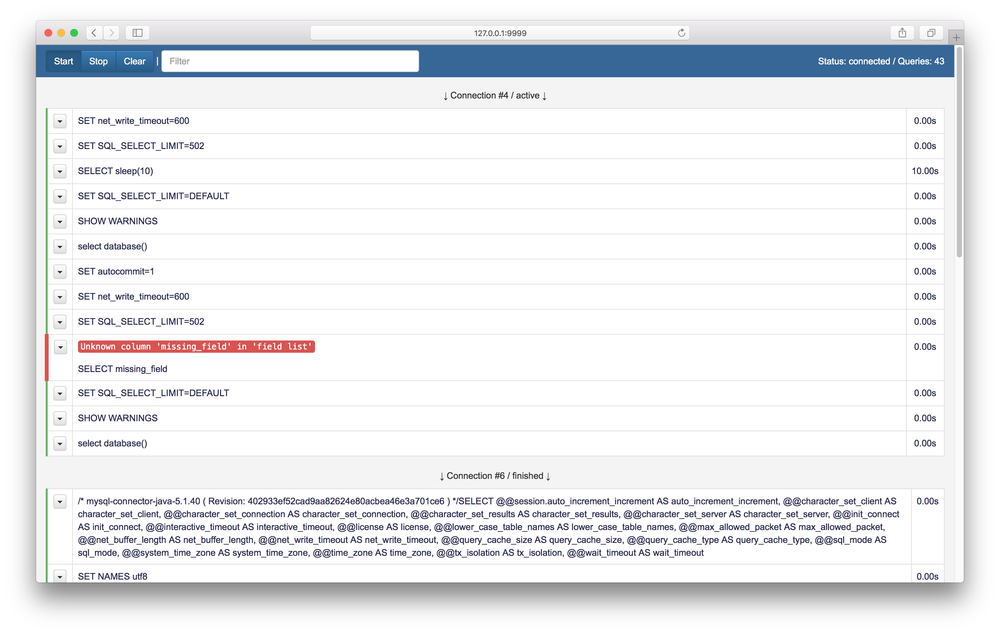
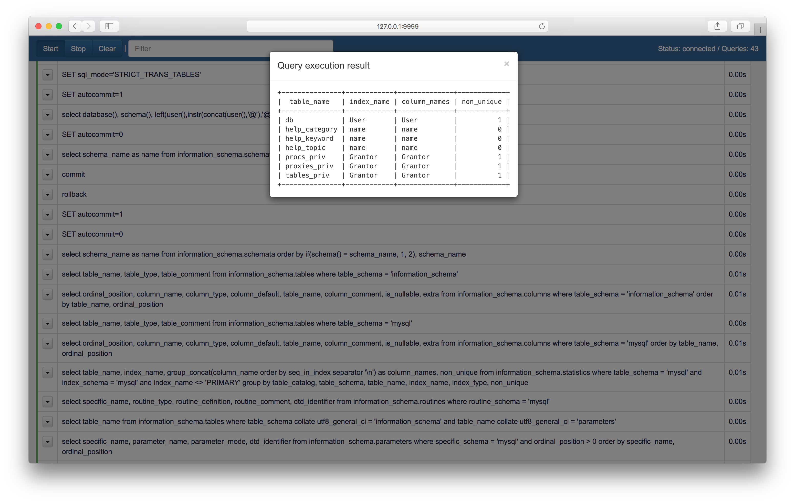

😎An out-of-the-box mysql proxy written by golang.

This is a proxy for **MySQL RDBMS** with web GUI. It will show you what's happening under the hood of your database layer.
As it sits between your application and MySQL server there's no need to use tools like Wireshark or enable general logs to see which queries are being executed.
It comes as single binary with zero dependencies and consists of 2 parts: proxy server and embedded GUI.

# Screenshots
| Select db                       | Query list                                | Freezed query                       | Query error                       | In app results                       |
|---------------------------------|-------------------------------------------|-------------------------------------|-----------------------------------|--------------------------------------|
|  |  |  |  |  |

# Main features

1. See all queries sent from your application to MySQL grouped by connection it belongs to.
2. Track query execution result: success(green indicator), pending(yellow indicator) and error(red indicator).
3. See query execution time(it includes time to transfer data over network).
4. Filter queries by string.
5. Execute any query and see results immediately.
6. Run mysql-proxy in Docker container.

# Installation
###### Binary
Get binaries from [releases](https://github.com/gogoods/mysql-proxy/releases) page

###### From sources on Mac/Linux
    go get github.com/gogoods/mysql-proxy
    go install github.com/mjibson/esc@v0.1.0
    cd $GOPATH/src/github.com/gogoods/mysql-proxy
    $GOPATH/bin/esc -o fs.go -prefix web -include=".*\.css|.*\.js|.*\.html|.*\.png" web
    go build
    ./mysql-proxy
    
# How to run
There're 4 simple steps to get everything up and running:
1. Run binary from terminal like this: `./mysql-proxy_linux_amd64`.
You'll see something like this:

    `Forwarding queries from '127.0.0.1:4041' to '127.0.0.1:3306'`
    
    `Web gui available at 'http://127.0.0.1:9999'`
     
2. Tell your app to connect to MySQL via port *4041* instead of *3306*.
3. Go to [http://127.0.0.1:9999](http://127.0.0.1:9999) and you'll see nice GUI.
4. Play with your app and see all SQL-queries flowing between your app and MySQL. 
**No need for page refresh because websockets are used to communicate between frontend and backend.**

# Use cases
Here're few use cases i use on my everyday basis so it may be helpful to someone.

###### Use locally
Just run mysql-proxy on your local machine and point your app to it.
You can also run few mysql-proxy instances each on it's own port. 
This is an easy way to keep multiple app separated and view queries independently.

###### Use remotely
Let's say you're writing your PHP code locally but run it on dev server and do not want to expose mysql-proxy to outside world.
In this case here's what you may do:
1. Upload mysql-proxy binary to remote dev server and run it like this: `./mysql-proxy_linux_amd64`
2. Create ssh tunnel from your local machine to remote dev server like this: `ssh -nNT -L 9999:127.0.0.1:9999 user@your-devserver.com`.
   This command will map your local `:9999` to remote `:9999`
3. Tell your remote app to use MySQL on port `:4041`
4. Open [http://127.0.0.1:9999](http://127.0.0.1:9999) locally.

# Configuration

See [config.yaml.example](./conf/config.yaml.example) as below:

```yaml
gui: "127.0.0.1:9999"
use_embed_ui: true
proxies:
   - alias: db1
     enabled: true
     listen: "127.0.0.1:19991"
     mysql: "ip:port"
   - alias: db2
     enabled: true
     listen: "127.0.0.1:19992"
     mysql: "ip:port"
```

1. `cp ./conf/config.yaml.example ./conf/config.yaml`
2. Edit `./conf/config.yaml` with your own configuration.

# ToDo
- [ ] Write Unit tests
- [ ] Implement more features of MySQL protocol
- [x] Add query filtering by string
- [ ] Add sql code highlighting
- [ ] Add sql code formatting
- [x] Add possibility to execute query right from GUI and see results
- [ ] Add ssl support
- [ ] Add support of PostgreSQL protocol 
- [ ] ... and more

# Known problems
Currently mysql-proxy does not support secure connections via ssl. The workaround is to disable SSL on MySQL server or connect with option like [--ssl-mode=DISABLED](https://dev.mysql.com/doc/refman/5.7/en/secure-connection-options.html#option_general_ssl-mode)

# Contribute
You're very welcome to report bugs, make pull requests, share your thoughts and ideas!

# Licence
MIT
